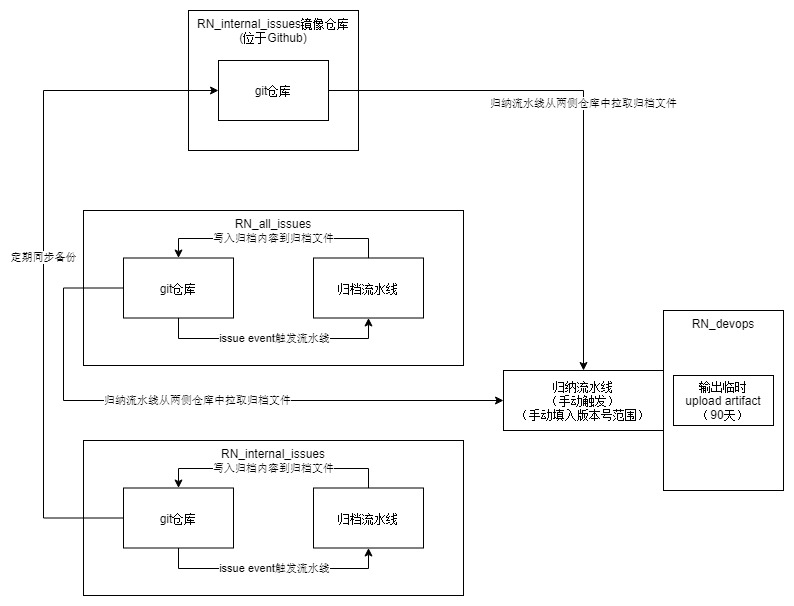

# 复仇时刻自动归档流水线

- 归档流水线将自动处理Issue关闭事件，并将被关闭的Issue信息格式化后写入归档文件后提交至仓库中。
- 归档流水线可以手动触发，若要手动触发归档流水线请参考[手动运行归档流水线指南](./手动运行归档流水线指南.md)

- 系统架构图：

# 文档目录
- [自动归档流水线使用指南](./自动归档流水线使用指南.md)
- [手动运行归档流水线指南](./手动运行归档流水线指南.md)
- [Config配置文档](./config/README.md)
- [流水线yml文件的部署和维护](./流水线yml文件的部署和维护.md) 
- [自动归档流程简述以及项目开发](./rn_issues_auto_archiving/README.md)

## 外部文档：

- 流水线dispatch（Restful API触发流水线）
    - Github ： https://docs.github.com/zh/rest/using-the-rest-api/getting-started-with-the-rest-api?apiVersion=2022-11-28#example-request-using-query-parameters
    - Gitlab ： https://docs.gitlab.com/ee/ci/triggers/#use-a-webhook
