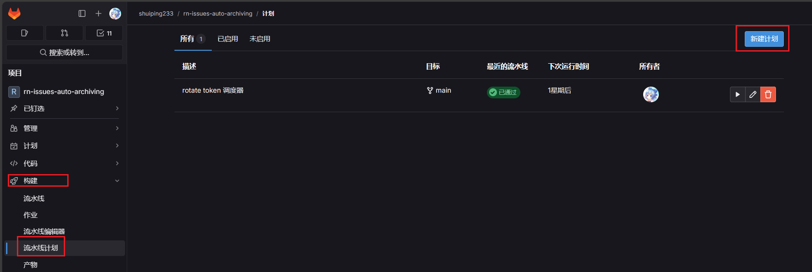
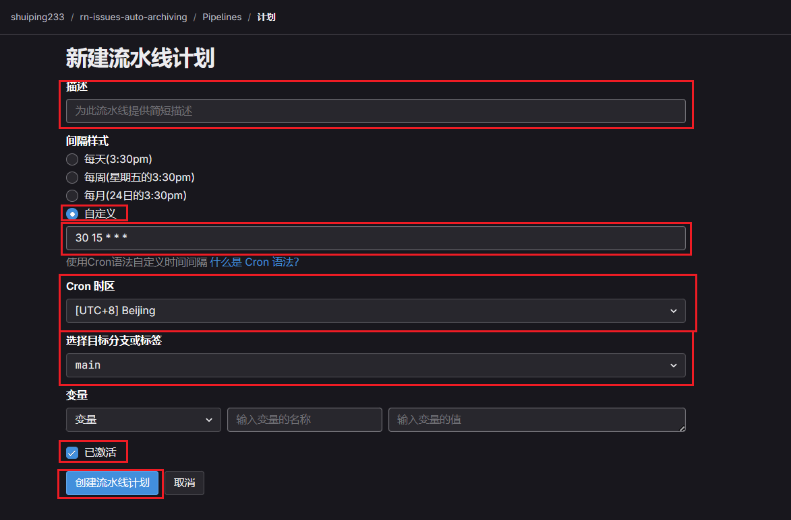
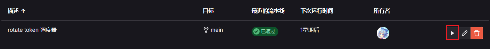

# 部署/维护指南

- Python脚本全部位于`./src/`目录下
- Github流水线脚本全部位于`./.github/workflows/`目录下，配置文件则在`./.github/configs/`
- Gitlab流水线脚本全部位于`./gitlab-ci.yml`，配置文件则在`./.gitlab/configs/`
- 脚本配置文件`auto_archiving.json`负责存储脚本处理Issue的行为，例如匹配所需的关键字，匹配Issue标签的类型等等。部分配置支持正则表达式，具体内容请参见[Config配置文档](./config/README.md)来修改[auto_archiving.json](./config/auto_archiving.json)

## github侧

- github侧什么都不需要做，完成流水线yml的部署即可

## gitlab侧

- 需要部署/管理的仓库变量：

    | 变量名 | 变量类型 | 描述                                                                                                                                                   |
    | ------ | -------- | ------------------------------------------------------------------------------------------------------------------------------------------------------ |
    | TOKEN  | secret   | 此token用于获取Issue信息，需要个人账号的PAT（个人访问令牌）的`API读写权限`和`仓库读写权限`，且需要PAT所属用户是目标仓库的`maintainer`或`owner`级别成员 |
    
- 现有生产环境下，使用的是`RN-Bot`账号的PAT，如果PAT失效或者异常，请联系拥有`RN-Bot`账号管理权限的管理员

- webhook配置
    - 由于gitlab ci 无法直接由Issue事件激活，所以需要配置webhook来激活gitlab ci归档流水线
    - 具体完整配置流程可参考 [Gitlab文档：Trigger pipelines by using the API](https://docs.gitlab.com/ee/ci/triggers/)
    - 配置说明：
        - 在Gitlab仓库页面左侧菜单栏的`Settings（设置）`里的`CI/CD`选项里找到`Pipeline trigger tokens（流水线触发令牌）`页面，创建一个“流水线触发器token”，这个token是不会过期的
        - 然后再`Webhooks`中点击`Add new webhook （添加新的webhook）`按钮，创建新的webhook
        - webhook的url请按照如下格式填写：
        `https://{GITLAB_HOST}/api/v4/projects/{PROJECT_ID}/trigger/pipeline?token={TOKEN}&ref={BRANCH_NAME}`
        - `{GITLAB_HOST}` ：替换为gitlab实际域名
        - `{PROJECT_ID}` ： 替换为仓库的ID，可通过gitlab仓库首页复制
        - `{TOKEN}` ： 替换为刚刚获取的`Pipeline trigger tokens（流水线触发令牌）`）
        - `{BRANCH_NAME}` ： 替换为 `main` 即可，如果流水线文件放在其他分支了或者有其他需求，可以替换为仓库的其他分支名称或者仓库git标签名称

- PAT轮换流水线配置
    - 由于gitlab在某个版本后PAT不能设置成永不过期了，需要一个定时运行的任务自动轮换（rotate）PAT，所以通过`流水线任务`+`调度器（scheduler）`来完成这件事
    
    
    - 配置说明：
        - 在Gitlab仓库页面左侧菜单栏的`Settings（设置）`里的`构建`选项里找到`流水线计划`选项，点击后进入新建流水线页面，点击页面右上角按钮`新建计划`
        
        - 填写新建流水线计划所需的信息，如下图所示
        
        - `描述`： 调度器在`流水线计划`页面显示的标题，标题清晰明了即可
        - `间隔样式`：选择`自定义`按钮 ，一个月执行一次足以（不会crontab语法可以参考使用 [crontab在线工具](https://tool.lu/crontab/) ）例如每隔30天的凌晨2点执行一次`0 2 */30 * *`。token轮换流水线默认轮换3个月（93天）后过期的token，如果你想调整轮换token的过期时间，请修改[RotateAccessToken.yml](.gitlab/workflows/RotateAccessToken.yml)的`TOKEN_TTL_DAYS`值
        - `Cron时区`： 选`[UTC+8] Beijing`即可
        - `已激活`： 必须勾选这个复选框，创建之后调度器自动按照间隔时间触发流水线

> [!NOTE]
> 调度器可以手动运行，如图所示：
